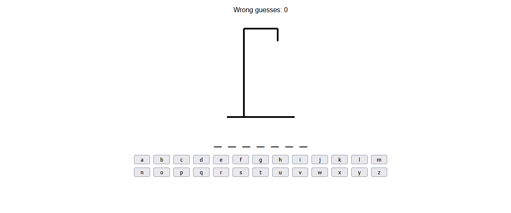

🔤 Hangman Game (React)

A simple and interactive Hangman game built using React.
Guess the hidden word one letter at a time, avoid too many wrong guesses, and try to win before the hangman drawing is complete.
✨ Features
🎮 Classic Hangman Gameplay

    Random word selected at the start of each game

    Click letters to guess

    Correct guesses reveal letters in the word

    Incorrect guesses draw parts of the hangman

🔁 Game Flow

    Win when all letters are revealed

    Lose when the hangman drawing is complete

    Restart button to play again instantly

⚛️ Built with React

    Functional components

    React Hooks for state management

    Clean, simple UI

    Smooth re-rendering on each guess

🧱 Tech Stack

    React — UI and state management

    CSS — styling and layout

    JavaScript (ES6+) — game logic

No backend, no external libraries — just a lightweight React project.
📦 Installation & Setup
bash

# Clone the repo
git clone https://github.com/your-username/react-hangman.git

# Install dependencies
npm install

# Start the development server
npm start

🎮 How to Play

    A random word is chosen automatically

    Click letters to guess them

    Correct letters appear in the word

    Wrong guesses draw the hangman

    Win by guessing the full word

    Lose if the hangman is fully drawn

    Click Restart to play again

# Future Improvements

Add difficulty levels (easy, medium, hard)

Add animations for correct/incorrect guesses

Add sound effects

Add a word category system

Add a scoreboard or win/loss tracking

## 📸 Screenshots

### Homepage

### Game Play
